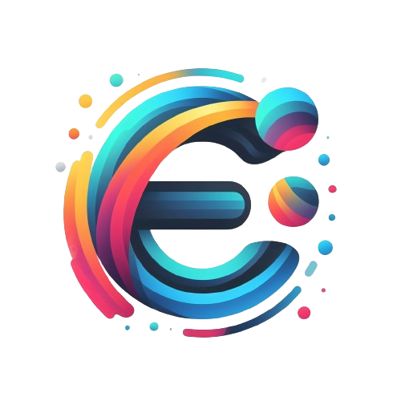

<div align="center">
 
  <br/>
  <h1><b>Event Harbor</b></h1>

</div>


<a name="readme-top"></a>

<!-- TABLE OF CONTENTS -->

# 📗 Table of Contents

- [📖 About the Project](#about-project)
  - [🛠 Built With](#built-with)
    - [Tech Stack](#tech-stack)
    - [Key Features](#key-features)
    - [🚀 Live Demo](#live-demo)
- [💻 Getting Started](#getting-started)
  - [Setup](#setup)
  - [Prerequisites](#prerequisites)
  - [Install](#install)
  - [Usage](#usage)
  - [Run tests](#run-tests)
  - [Deployment](#triangular_flag_on_post-deployment)
- [👥 Authors](#authors)
- [🔭 Future Features](#future-features)
- [🤝 Contributing](#contributing)
- [⭐️ Show your support](#support)
- [🙏 Acknowledgements](#acknowledgements)
- [🙏 Attribution](#attribution)
- [❓ FAQ](#faq)
- [📝 License](#license)


<!-- PROJECT DESCRIPTION -->

# 📖 [Event Harbor] <a name="about-project"></a>

Event Harbor is a dynamic Full Stack event management web application, showcasing a sophisticated front-end developed using React. Users can effortlessly add, update, and delete events through an intuitive and responsive interface. The project is intricately designed with TailwindUI and Tailwind CSS, ensuring a visually appealing and modern user experience.

Behind the scenes, the back-end API powers the application, built with Ruby on Rails and supported by a PostgreSQL database. The API, residing in a separate repository, seamlessly integrates with the React front end, offering a comprehensive solution for managing events.

As an ongoing project, Event Harbor is committed to delivering a seamless and feature-rich event management experience. Stay tuned for updates and improvements as we continue to refine both the React front end and the Ruby on Rails API.


## 🛠 Built With <a name="built-with"></a>

## Tech Stack <a name="tech-stack"></a>

- **Framework:** [Ruby on Rails](https://rubyonrails.org/)
- **Programming Language:** [Ruby](https://www.ruby-lang.org/en/)
- **Database:** [PostgreSQL (PSQL)](https://www.postgresql.org/)
- **Testing Frameworks:**
  - [RSpec-Rails](https://github.com/rspec/rspec-rails)
  - [Capybara-Rails](https://teamcapybara.github.io/capybara/)
- **CSS Bundling:** [Rails CSS Bundler](https://github.com/rails/cssbundling-rails)
- **Authorization:** [Cancan](https://github.com/CanCanCommunity/cancancan)
- **Authentication:** [Devise](https://github.com/heartcombo/devise)
- **Database Adapter:** [Ruby Pg](https://github.com/ged/ruby-pg)
- **Code Quality:** [Rubocop](https://github.com/rubocop/rubocop-rails)
- **Browser Automation:** [Selenium Webdriver](https://rubygems.org/gems/selenium-webdriver/versions/4.4.0)
- **Front-end:** [React](https://reactjs.org/)
- **Front-end Styling:** [TailwindCSS](https://tailwindui.com/)

## Key Features <a name="key-features"></a>

1. **Data Model:** A robust data model ensuring efficient storage and retrieval of event-related information.

2. **Validations:** Comprehensive data validations to maintain data integrity and consistency.

3. **Model Spec-Tests:** Rigorous specification tests for models to ensure they meet the defined requirements.

4. **Controller Specs:** Well-documented and tested controllers to guarantee proper handling of requests and responses.

5. **Create Event:** Seamless functionality allowing users to create new events with ease.

6. **Update Event:** User-friendly interface for updating event details, ensuring accurate and up-to-date information.

7. **Delete Event:** Secure and straightforward deletion of events as needed.

8. **View Events:** Intuitive views enabling users to easily navigate and explore the list of available events.

## React Features

- **Front-end Framework:** Utilizing [React](https://reactjs.org/) for building a dynamic and responsive user interface.

- **Component-Based Architecture:** Leveraging React's component-based structure for modular and maintainable code.

- **State Management:** Implementing state management to efficiently handle and update the application's state.

- **React Router:** Enabling seamless navigation and a single-page application experience with React Router.

- **Hooks:** Utilizing React Hooks for functional components, ensuring the efficient management of state and side effects.

- **Reusable Components:** Developing reusable components to promote code reusability and maintainability.

- **Responsive Design:** Implementing responsive design principles for a consistent and user-friendly experience across devices.


<p align="right">(<a href="#readme-top">back to top</a>)</p>

<!-- LIVE DEMO -->

## 🚀 Live Demo <a name="live-demo"></a>

> Live Demo:

- [Live Demo Link](https://event-harbor.onrender.com)

<p align="right">(<a href="#readme-top">back to top</a>)</p>

<!-- GETTING STARTED -->

## 💻 Getting Started <a name="getting-started"></a>

To get a local copy up and running, follow these steps.

### Prerequisites

In order to run this project you need:

### Setup

Clone this repository to your desired folder:


```sh
  cd my-folder
  git clone https://github.com/RileyManda/event-harbor.git
```


### Install

Install this project with:

    ```sh
    cd my-project
    bundle install
    ```
    ```sh

### Usage

To run the project, you will need to execute:


```sh

  ./bin/dev

```


### Run tests

To run tests, run the following command:


```sh
  Rspec spec  or bundle exec rspec spec
```


<!-- ### Deployment

You can deploy this project using: -->

<!--
Example:

```sh

```
 -->

<p align="right">(<a href="#readme-top">back to top</a>)</p>

<!-- AUTHORS -->

## 👥 Authors <a name="authors"></a>

👤 **RileyManda**

- GitHub: [@RileyManda](https://github.com/RileyManda)
- Twitter: [@rilecodez](https://twitter.com/rileycodez)
- LinkedIn: [rileymanda](https://www.linkedin.com/in/rileymanda/)


<p align="right">(<a href="#readme-top">back to top</a>)</p>

<!-- FUTURE FEATURES -->

## 🔭 Future Features <a name="future-features"></a>

> Deploy application to Render
> Video Presentation> Deploy Application
> Application styling

<p align="right">(<a href="#readme-top">back to top</a>)</p>

<!-- CONTRIBUTING -->

## 🤝 Contributing <a name="contributing"></a>

Contributions, issues, and feature requests are welcome!

Feel free to check the [issues page](https://github.com/RileyManda/event-harbor/issues).

<p align="right">(<a href="#readme-top">back to top</a>)</p>

<!-- SUPPORT -->

<!-- SUPPORT -->
## <b>Show your support 🌟</b><a name="support"></a>

Thank you for taking the time to explore this project! Your support means a lot to me. If you find my project valuable and would like to contribute, here is one way you can support me:

 - <b>Star the project ⭐️</b>: Show your appreciation by starring this GitHub repository. It helps increase visibility and lets others know that the project is well-received.

 - <b>Fork the project 🍴 🎣</b>: If you're interested in making improvements or adding new features, feel free to fork the project. You can work on your own version and even submit pull requests to suggest changes.

 - <b>Share with others 🗺️</b>: Spread the word about this project. Share it on social media, mention it in relevant forums or communities, or recommend it to colleagues and friends who might find it useful.

<p align="right">(<a href="#readme-top">back to top</a>)</p>

<!-- ACKNOWLEDGEMENTS -->

## 🙏 Acknowledgments <a name="acknowledgements"></a>

I would like to express my sincere gratitude to [Microverse](https://github.com/microverseinc), for introducing me to Ruby and Ruby on Rails.
<p align="right">(<a href="#readme-top">back to top</a>)</p>

<!-- FAQ (optional) -->

## ❓ FAQ <a name="faq"></a>

- **Question_1**

  Do I have to use the vs code specifically?

  - Answer_1

    You can use any code editor of your choice. <br>


<p align="right">(<a href="#readme-top">back to top</a>)</p>

<!-- ATTRIBUTION -->
 ## 👥 Attribution <a name="attribution"></a>
- ProjectIcon: [Svgrepo](https://www.svgrepo.com/)

<!-- LICENSE -->

## 📝 License <a name="license"></a>

[MIT License](./LICENSE)

<p align="right">(<a href="#readme-top">back to top</a>)</p>

